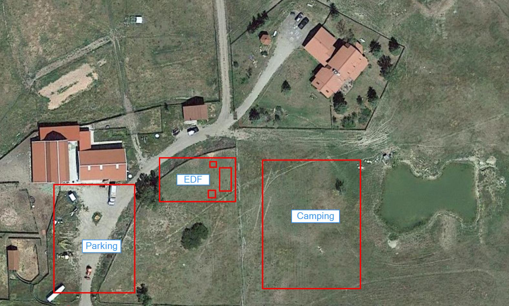
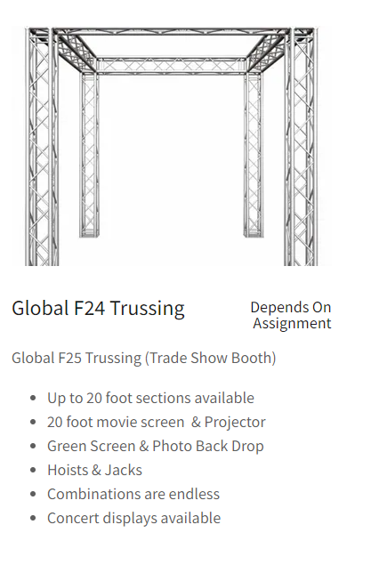
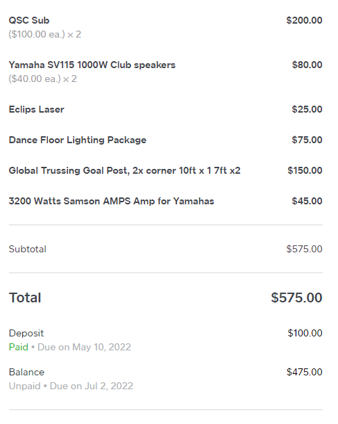
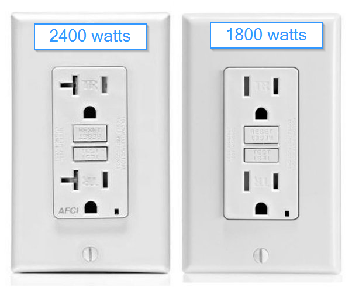

## Bean Planning 🗒️

This page is dedicated to all administrative planning details for the bean summit

## EDF Info 💡

Information about planning for EDF

### EDF Map 🗺️

A map of suggested areas for EDF at the Dairy

### Pickup / Drop off 🚗

We will be renting all our main sound equipment from [Colorado Mobile Music](https://coloradomobilemusic.com/)

Here are some general details about picking up and dropping off the equipment:

- I (@grantbirki) will be in Denver, CO on July 2nd to pick up the equipment with Ian
- We will go straight from Denver, CO to the Dairy to setup for EDF
- We plan on camping at the Dairy the night of EDF. The following day is July 3rd and someone will need to return the equipment to Colorado Mobile Music so we do not get charged for a second day of rentals

Colorado Mobile Music Info:

- Address: [Google Maps Link](https://goo.gl/maps/QLXCj81rMXbLHF4cA)
- Phone: 303-781-1753
- Pickup: July 2nd
- Dropoff: July 3rd

## Equipment 🔈

For the main stage, we will be using the trussing as seen below. We can mount Daniel's light board to the trussing as well

The full order from Colorado Mobile Music is as follows:

### Power Consumption 🔌

This section will go into details about power consumption estimates for all equipment

#### Wall Outlets

- Standard US Wall Socket: 15 amps * 120 Volts = **1800 watts** (max safe 1440 watts)
- Thicc US Wall Socket: 20 amps * 120 Volts = **2400 watts** (max safe 1920 watts)

#### Total Power Consumption

> Note: All numbers are rounded up for safety

| Item 🔈 | Max Power (watts) ⚡ |
| ------ | ----------- |
| [Yamaha S115V 1000W 15](assets/images/S115V-speaker.png) | 500W x2 |
| [QSC KW181](assets/images/qsc-sub.png) | 300W x2 |
| [Eclipse Laser](assets/images/eclipse.jpg) | 10W |
| [Chauvet Slim Par IRC](assets/images/chauvet-slim-par.png) | 140W x2 |
| [Chauvet Cubix](assets/images/chauvet-cubix.png) | 55W x2 |
| [3200W Samson AMP](assets/files/samson-amp-specs.pdf) | W x2 |
| [Bean Board](https://github.com/GrantBirki/bean-board) | 600 W |
| **TOTAL** | 2,600W |

#### Connection Diagram 📊

It might be overkill but we should probably create a diagram of all the connections on the equipment we are renting for the following reasons:

- So we can be familiar for connecting the devices
- So we can determine if we need any extra cables
- So we can discover any potential issues before we find them during setup at the Dairy

#### The Bean Board

The bean board will need ~600 watts and 4 outlets. It is 70 inches diagonally

Source code can be found [here](https://github.com/GrantBirki/bean-board)
